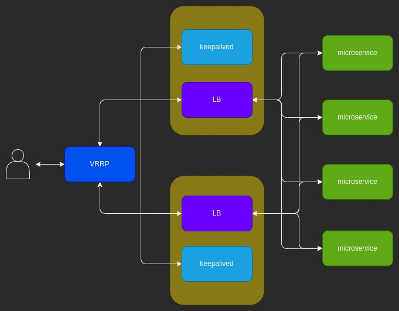

# golang-loadblancer-keepalived
A simple HA config setup  with keepalived (VRRP) and golang load balancer

## Building

### Build for arn architecture

GOOS=linux GOARCH=arm go build main.go server.go -o golang-lb


### Build for amd architecture 

GOOS=linux GOARCH=amd64 go build main.go server.go -o golang-lb

### Config

Update the keepalived.conf file (change as required)

Copy the config file to /etc/keepalived/ to each of the load balancer servers (master and backup)

Start the keepalived service on both master and backup servers

```bash
sudo systemctl start keepalived
```

## Usage

./golang-lb --backends=http://192.168.8.161:9000,http://192.168.8.153:9000,http://192.168.8.156:9000,http://192.168.8.159:9000


## Diagram



## References

This project is a clone from https://github.com/kasvith/simplelb

I have added the config for HA keepalived to iot backend microservices

